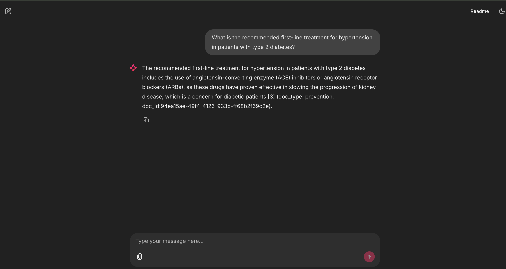

# med_bot

In this repo we developed a question-answer system, that is aimed (finetuned and grounded) to answer medical related questions. This solution is able to answer questions using a familiar and easy to use interface.

### Example Interactions
 
 
 

### The Solution
 
The proposed solution is composed of the following elements:
- a fullstack chainlit app that serves both 
    - UI (chat interface)
    - backend composed of a langchain chain that implements:
        - a finetuned llm model
        - a retriever component (using FAISS)
        - a ChatMessageHistory to enable follow-up questions
- a vLLM inference component, to decouple backend compute from GPU focused compute

#### Asumptions
- we assumed that the `intern_screening_dataset.csv` dataset was a real word representation of common question-answers that was recollected by our systems.
- we assumed that we want the users of this app to be able to receive responses in a reasonable time (< 3s of respone time)
- we assumed that answers need to be curated from validated information
- we assumed that the current system infraestructure already handles authentication

### Data Analysis and processing
We conducted an EDA on the provided dataset and identified that:
- we have 16406 records in total
- we have questions w/o answers
- some questions seems to be generated synthetically (i.e. there are some variations on what/why/how/etc.)
- all questions seems to be correct (they start with wh-word/do/could/etc and end in ?)
- some answers are not valid: 
    - some repeat a lot of following questions
    - some repeat the same questions that was asked
- there is an answer that is used for 348 questions
- there are some questions with different answers

Based on that, we decided to clean and cure a subset of the questions to be used to finetune an LLM more details under `scripts/prepare_dataset.py`

### Training
After we cureted our training and validation datasets, we proceded to train, we conducted a small experiment to evaluate candidate LLMs more details can be seen in `notebooks/research_llm_candidates.ipynb` but in summary, we decided to test two models: "unsloth/Meta-Llama-3.1-8B-Instruct-bnb-4bit" and "unsloth/Phi-3.5-mini-instruct". 

We used the unsloth documentation for reference on training models on limited resources (we used a RTX 3060ti with 12GB vRAM for training). We used:
- PEFT training, specifically LORA
- model quantization 4-bit
- we used a 8-bit version of AdamW Optimizer

### Validation
for Validation we used the validation set (20% form total records) to compare the model performance, in total we compared 4 models:
- Llama base
- Phi base
- Llama finetuned
- Phi finetuned

as metrics we used:
- rouge_scores: to compare the generated answers against the validation-set source of truth. This metric mainly help us identify if both text are using similar words to answer the question, but if can potentially have low scores if one model decide to use a different vocavulary
- bertscore: to have a semantic comparison. This metric help us desambiguate a bit the rouge score and apport some semantic comparison, so even if the model decides to use different words, if the meaning is similar we won penalize as much.

more details can ve found in `notebooks/research_llm_candidates.ipynb`

In summary, we found that even tho bertscore is helpful, there are some cases (especially if the answers as short enought) when bert assigned higher than expected scores. Because of this, we used manual evaluation as well to decide if the generates answers made sense.

 e.g.:

| Phi Base                            |
|------------------------------------|
|     |
| Phi Finetuned                        | 
|     |

### Extra details
We noted that after finetuning the models, they got much better responses, especially the Phi based one, but since we wanted to give a more solid response to the user (`we assumed that answers need to be curated from validated information`) we decided to also implement a RAG based approach to augment and provide our models with relevant context.

For this we used an opensource dataset `keivalya/MedQuad-MedicalQnADataset` more information can be found in `scripts/setup_vbd.py`. We used this dataset to create a simple FAISS Vector store to be consumed as a retriever by our final chain. This allowed the model to provided not only responses in a similar writter way as our original dataset, but also grounded in relevant information. (the system is able to cite the document ids used to answer the question)

### Potential Improvements

 There are many improvements to be implemented in this project:

 - due to resource constrains we could not test the models with larger amounts of datapoints
 - due to time constrains we were not able to systematically validate the system response time and performance under load (although the system dessigen that was implemente should be a good step in the rigth direction specially when implementing vLLM to decouple our app with the resource intensive models)
 - we could also decouple the embedding part of the chain and use GPU aceleration to speed up a bit the retrieval step
 - due to time constrains we were not able to implement (deploy in docker) langfuse to track all the chain interactions
 - the methodologies to select good data examples for the finetuning step were simple, and maybe spending more time here could help the finetuned models to perform even better.
 - 